# Student Project

## Description

این پروژه برای تمرین عملی Git و GitHub ساخته شده.

توی این پروژه از ساخت یک Local Repository و اولین Commit شروع کردم و بعد با Branch، Merge، Stash، Revert و Reset کار کردم.

در ادامه Local Repository رو به GitHub وصل کردم و Push، Pull، Clone و Upstream رو انجام دادم. برای بخش Merge Conflict هم طبق تمرین یک قسمت از فایل `README.md` رو در دو Branch به شکل متفاوت تغییر دادم تا Conflict ایجاد بشه و بعد اون رو داخل VS Code حل کردم.

در بخش آخر هم یک Private Repository ساختم، یک Collaborator بهش اضافه کردم و اتصال به GitHub رو با Personal Access Token و SSH Key انجام دادم.


## Project Information

```text
Local Git user.name: Nariana
Local Git user.email: nargeshosseini.j@gmail.com
GitHub username: Nariana1999
GitHub Repository: student_project
```

Repository:

[https://github.com/Nariana1999/student_project](https://github.com/Nariana1999/student_project)


## How to Run

فایل اصلی پروژه `main.py` هست و با دستور زیر اجرا میشه:

```bash
python3 main.py
```

این پروژه Package خارجی نیاز نداره.


## Git Concepts Used

توی این پروژه با این مفاهیم و دستورهای Git و GitHub کار کردم:

- Local Repository
- Remote Repository
- `git status`
- Staging
- Commit
- `git diff`
- Amend
- Branch
- Merge
- Stash
- Revert
- Reset
- Push
- Pull
- Clone
- Upstream
- Merge Conflict
- Public Repository
- Private Repository
- Collaborator
- Personal Access Token
- SSH Authentication


## Screenshots

برای اینکه مراحل اصلی کار مشخص باشه، از بخش‌های مهم اسکرین‌شات گرفتم.

### Branch و Merge

یک Branch به اسم `feature` ساختم، تغییرات مربوط به اون رو Commit کردم و بعد Branch رو با Branch اصلی Merge کردم.

با `git log --oneline --graph --all` هم History رو بررسی کردم و مشخص بود Commitهای هر دو مسیر داخل History باقی موندن.

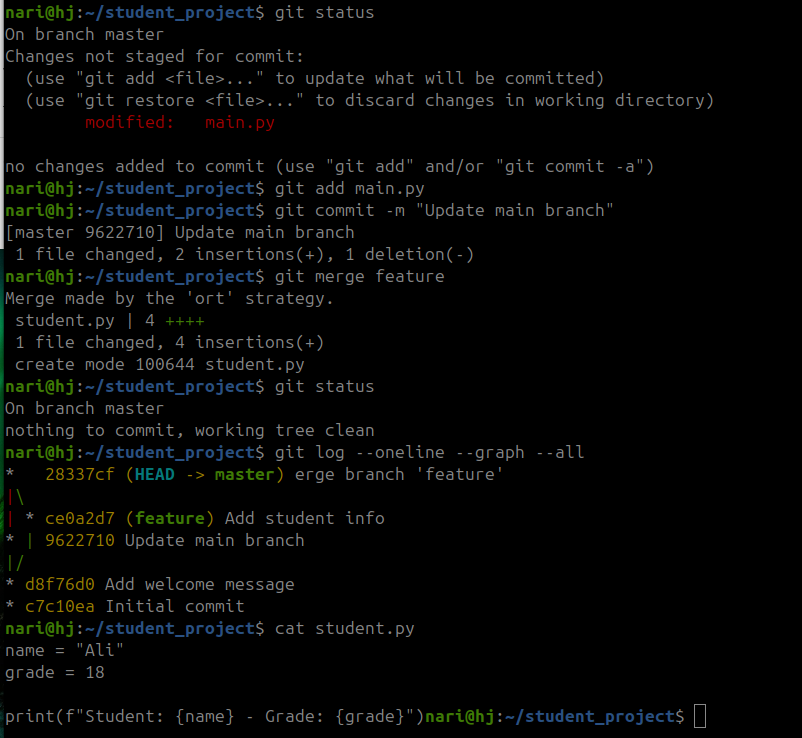


### Stash و Bugfix Branch

برای نگه داشتن موقت تغییرات Commit نشده از `git stash` استفاده کردم تا بتونم روی Branch دیگه‌ای کار کنم. بعد از برگشت به Branch اصلی، تغییر Stash شده رو دوباره برگردوندم.

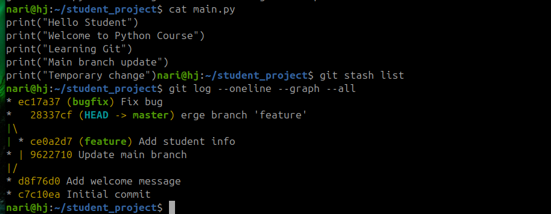


### Revert

با `git revert` اثر Commit مربوط به `secret.txt` رو برگردوندم. بعد با `git log` بررسی کردم و Commit قبلی همچنان داخل History باقی مونده بود و Revert به صورت یک Commit جدید ثبت شده بود.

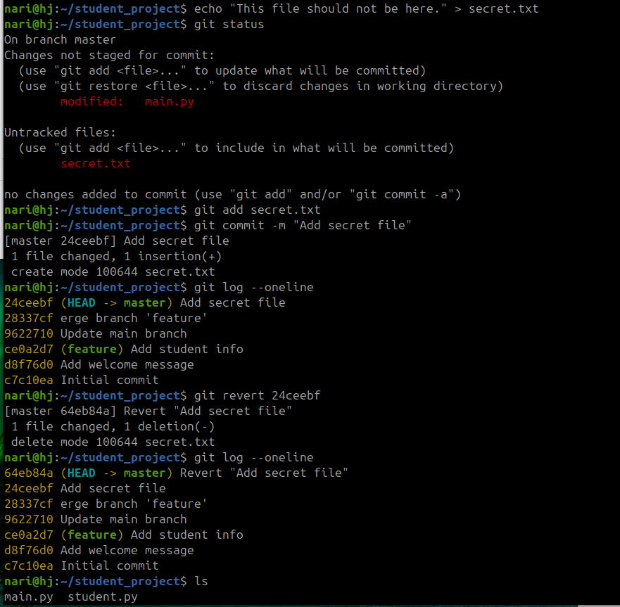


### Reset

یک Commit آزمایشی ساختم و بعد با `git reset --hard HEAD~1` به Commit قبلی برگشتم.

با `git log` قبل و بعد از Reset بررسی کردم و Temporary Commit بعد از Reset دیگه در History فعلی Branch دیده نمی‌شد. تفاوتی که اینجا با Revert دیدم این بود که Revert تاریخچه قبلی رو نگه می‌داره، ولی Reset می‌تونه مسیر History فعلی Branch رو تغییر بده.

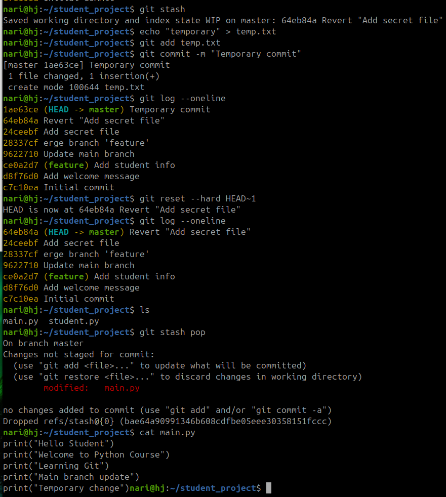


### اتصال Local Repository به GitHub

Local Repository رو با Remote به اسم `origin` به Repository ساخته شده در GitHub متصل کردم و Branch اصلی رو برای اولین بار Push کردم.

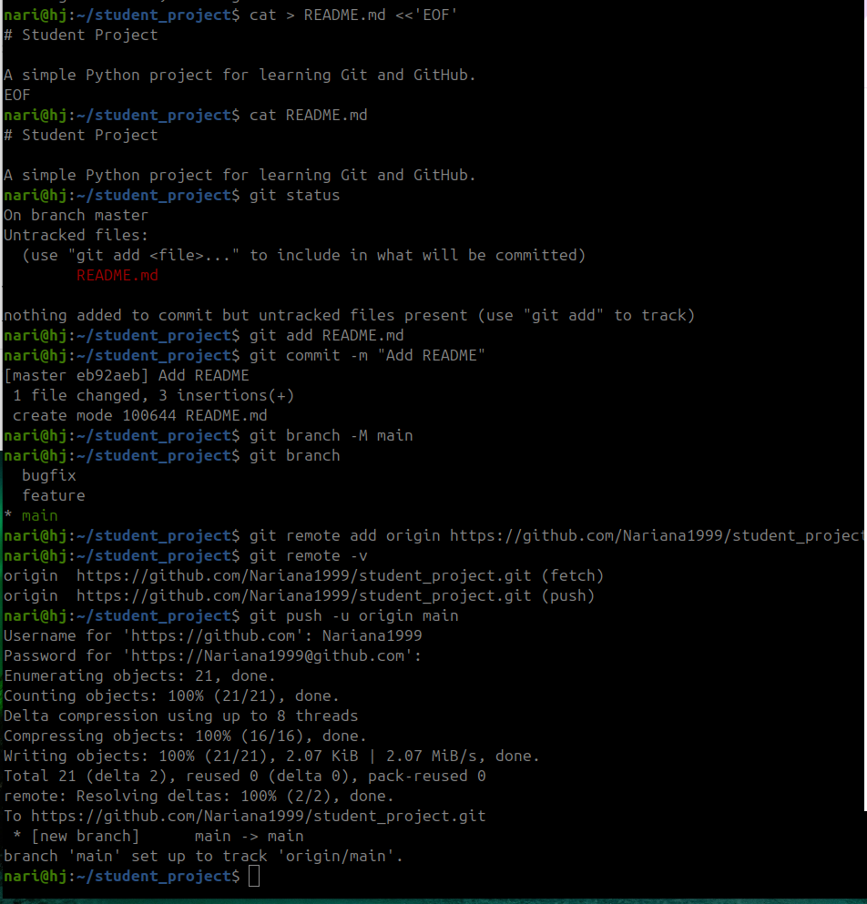


### GitHub Repository

بعد از اولین Push، فایل‌ها و Commitهای پروژه روی GitHub قرار گرفتن.

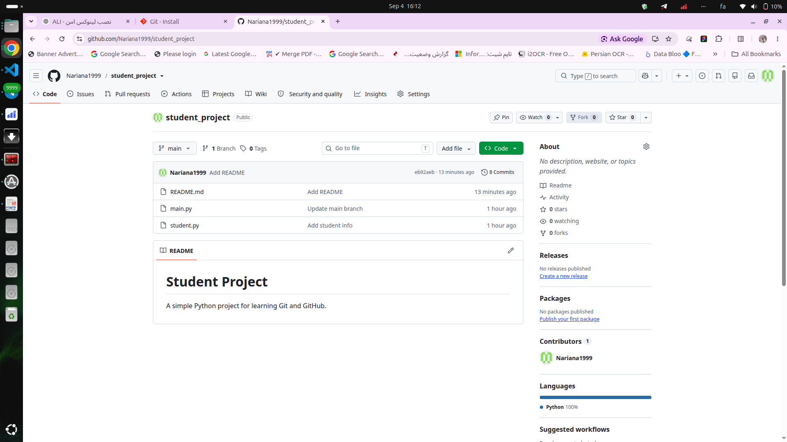


### Upstream

برای Branch `feature/student-info` در اولین Push از `-u` استفاده کردم تا Upstream تنظیم بشه. بعد از اون Push بعدی فقط با `git push` انجام شد و لازم نبود Remote و Branch دوباره مشخص بشن.

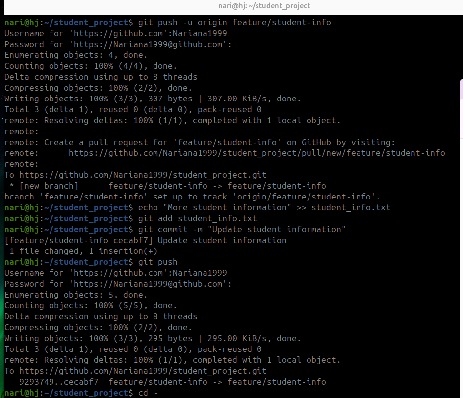


### Clone و Pull

Repository رو داخل یک پوشه جدید Clone کردم تا حالت کار روی یک سیستم دوم شبیه‌سازی بشه. بعد از Clone، Remote Branchها و `origin` رو بررسی کردم. بعد از ایجاد و Push یک تغییر از نسخه Clone شده، با `git pull` تغییرات رو داخل Repository اصلی دریافت کردم.

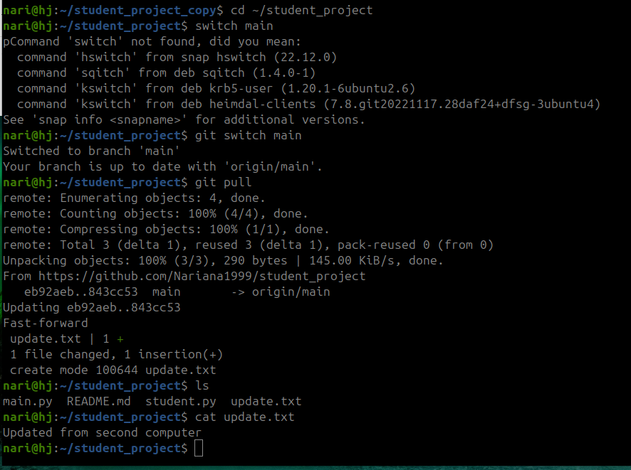


### Merge Conflict

در بخش Merge Conflict یک قسمت از `README.md` در دو Branch متن متفاوت داشت و موقع Merge، Git نتونست اون قسمت رو به صورت خودکار Merge کنه.

Conflict اول داخل Terminal مشخص شد:

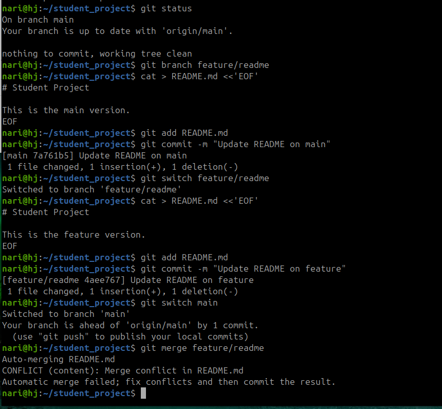

بعد همون Conflict داخل VS Code به این شکل دیده شد:

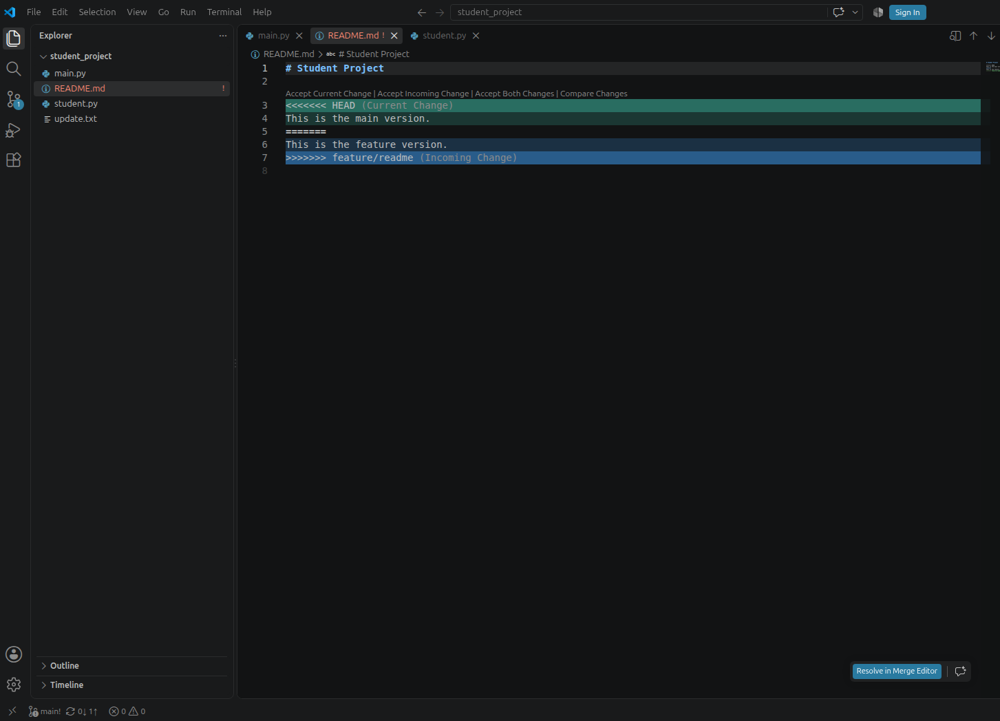

بعد از حل Conflict و Commit کردن تغییرات، با `git status` بررسی کردم و Repository دوباره در وضعیت Clean قرار گرفت.

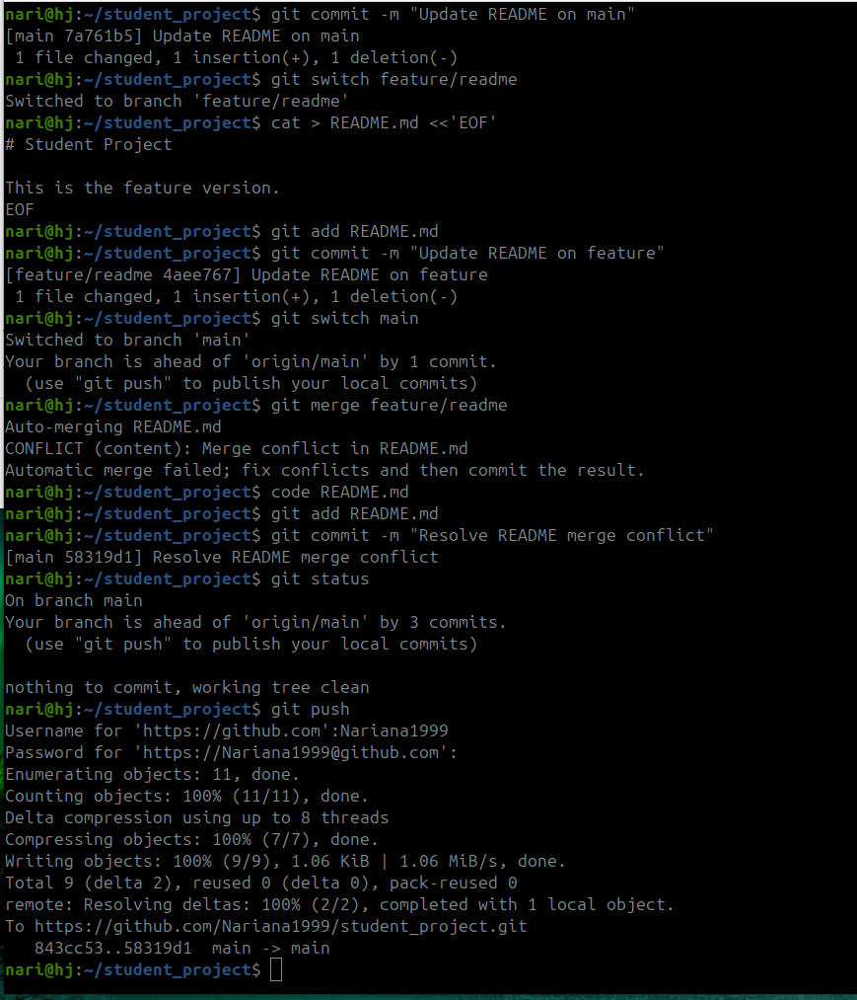


### Private Repository و Collaborator

یک Private Repository به اسم `student_private_project` ساختم و یک نفر رو به عنوان Collaborator بهش دعوت کردم.

Public Repository برای همه قابل مشاهده است، ولی Private Repository فقط برای Owner و افرادی که دسترسی دارن قابل مشاهده است. Collaborator هم اجازه مشارکت در Repository رو داره، در حالی که فردی که فقط Repository رو مشاهده می‌کنه دسترسی مستقیم برای Push کردن تغییرات نداره.

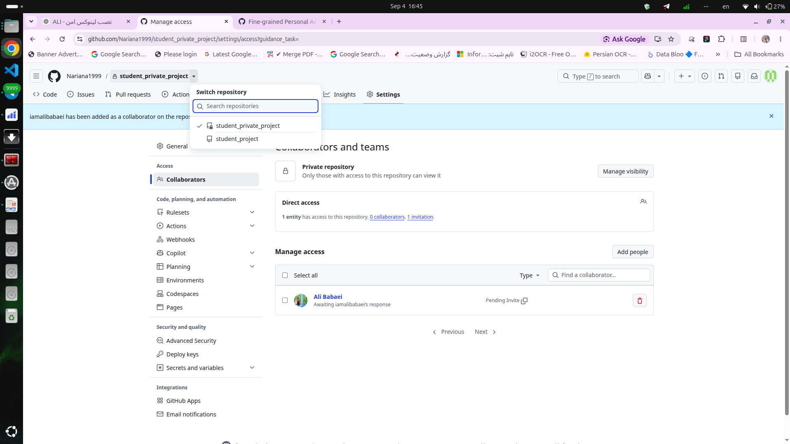


### Authentication و SSH

برای اتصال HTTPS از Personal Access Token به جای Password معمولی GitHub استفاده کردم. Token می‌تونه دسترسی و زمان اعتبار مشخص داشته باشه و در صورت نیاز جداگانه Revoke بشه.

بعد یک SSH Key ساختم، Public Key رو داخل GitHub ثبت کردم و اتصال SSH رو تست کردم. Private Key فقط روی سیستم Local باقی می‌مونه و نباید داخل Repository یا README قرار بگیره.

در آخر Remote پروژه رو هم از HTTPS به SSH تغییر دادم.

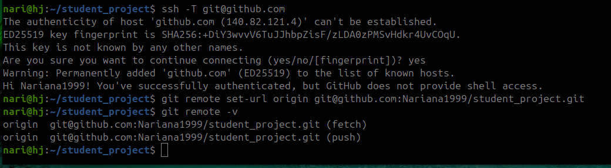


## Author

Narges Hosseini